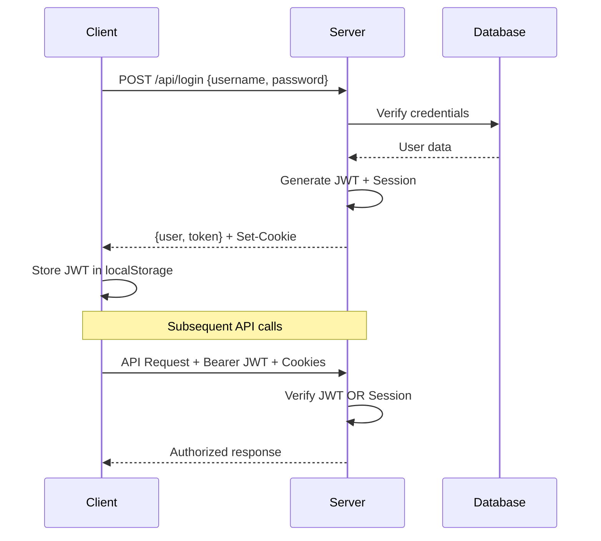

# 🏗️ ScholarSync - Technical Architecture Deep Dive

## 📋 **Executive Summary**

ScholarSync is a production-ready, AI-powered academic research and collaboration platform built with modern web technologies. This document provides comprehensive technical details for developers, system administrators, and technical stakeholders.

---

## 🎯 **System Overview**

### **Core Architecture**
```
┌─────────────────┐    ┌─────────────────┐    ┌─────────────────┐
│   React Client  │    │  Express API    │    │   PostgreSQL    │
│                 │◄──►│                 │◄──►│                 │
│  - TypeScript   │    │  - TypeScript   │    │  - Drizzle ORM  │
│  - React Query  │    │  - JWT Auth     │    │  - RBAC Schema  │
│  - shadcn/ui    │    │  - WebSockets   │    │  - Migrations   │
└─────────────────┘    └─────────────────┘    └─────────────────┘
         │                       │                       │
         │              ┌─────────────────┐              │
         │              │  Backblaze B2   │              │
         │              │                 │              │
         └──────────────►│  File Storage   │◄─────────────┘
                        │  Signed URLs    │
                        └─────────────────┘
                                 │
                        ┌─────────────────┐
                        │   AI Services   │
                        │                 │
                        │  - OpenRouter   │
                        │  - Grok 4 Fast  │
                        │  - CrossRef API │
                        │  - arXiv API    │
                        └─────────────────┘
```

---

## 🎨 **Frontend Architecture**

### **Technology Stack**
- **React 18**: Modern React with hooks and concurrent features
- **TypeScript**: Full type safety and developer experience
- **Vite**: Fast build tool with HMR and optimized production builds
- **TanStack React Query**: Server state management and caching
- **wouter**: Lightweight routing library
- **shadcn/ui**: Modern, accessible UI component library
- **Tailwind CSS**: Utility-first CSS framework
- **Framer Motion**: Smooth animations and transitions

### **Application Structure**

#### **Route Architecture**
```typescript
// Main Routes
/                    → FilesPage (Home)
/projects           → ProjectsPage 
/tasks              → TasksPage
/ai-tools           → AIToolsPage
/citations          → CitationGenerator
/dashboard          → Dashboard (composite view)

// Query Parameter Support
/projects?create=true        → Auto-open create project modal
/projects?project=123        → Auto-select specific project
```

#### **Component Hierarchy**
```
App
├── ThemeProvider
├── QueryClientProvider  
├── AuthProvider
├── TooltipProvider
└── AuthenticatedApp
    ├── Header (Global)
    └── Router
        ├── FilesPage
        ├── ProjectsPage
        │   ├── ProjectList
        │   └── ProjectDashboard
        │       ├── TeamManagement
        │       ├── TaskDashboard
        │       └── FileUploadZone
        ├── TasksPage
        ├── AIToolsPage
        │   └── AIToolsPanel
        │       ├── WritingAssistant
        │       ├── CitationGenerator
        │       ├── LiteratureSearch
        │       ├── OutlineBuilder
        │       └── DataAnalysisHelper
        └── Sidebar (Persistent)
```

### **State Management Strategy**

#### **Server State (React Query)**
```typescript
// Query Key Convention: Always array starting with "api"
["api", "projects"]                    // All user projects
["api", "projects", projectId, "tasks"] // Project-specific tasks
["api", "files", projectId]            // Project files
["api", "user"]                        // Current user info
```

#### **Local State (React useState)**
- UI state (modals, tabs, form inputs)
- Temporary data (search queries, filters)
- Component-specific state

#### **Persistent State (localStorage)**
- Authentication token (`authToken`)
- User preferences (theme, pinned tools)
- UI state (collapsed sections)

### **Data Flow Patterns**

#### **Query Pattern**
```typescript
const { data, isLoading, error } = useQuery({
  queryKey: ["api", "resource"],
  // queryFn automatically provided by queryClient
});
```

#### **Mutation Pattern**
```typescript
const mutation = useMutation({
  mutationFn: async (data) => {
    const response = await fetch("/api/endpoint", {
      method: "POST",
      headers: { "Content-Type": "application/json" },
      body: JSON.stringify(data),
      credentials: "include",
    });
    if (!response.ok) throw new Error("Failed");
    return response.json();
  },
  onSuccess: () => {
    queryClient.invalidateQueries({ queryKey: ["api", "resource"] });
    toast({ title: "Success!" });
  },
});
```

---

## ⚙️ **Backend Architecture**

### **Technology Stack**
- **Node.js 18+**: JavaScript runtime
- **Express.js**: Web application framework
- **TypeScript**: Type-safe development
- **Drizzle ORM**: Type-safe database access
- **PostgreSQL**: Primary database
- **WebSockets**: Real-time communication
- **AWS SDK**: S3-compatible Backblaze B2 integration

### **Service Architecture**

#### **Core Services**
```typescript
// Authentication & Authorization
AuthService          // JWT token management
SessionManager       // Session-based auth

// Data Access Layer
StorageService       // Database operations with RBAC
DatabaseStorage      // Drizzle ORM implementation

// AI Integration
AIService           // OpenAI/OpenRouter integration
CitationService     // Academic citation processing
LiteratureService   // Academic paper discovery
OutlineService      // AI-powered outline generation
DataAnalysisService // Statistical analysis and code generation

// Infrastructure
NotificationService // Real-time WebSocket notifications
StorageService      // Backblaze B2 file management
```

#### **Database Schema**
```sql
-- Core Tables
users                 -- User accounts and profiles
projects              -- Research projects
project_members       -- Team membership with roles
files                 -- Document storage with cloud keys
tasks                 -- Project tasks and assignments
conversations         -- Team chat conversations
messages              -- Chat messages
notifications         -- Real-time notifications

-- Version Control
document_versions     -- File version history
change_records        -- Document change tracking
conflict_resolutions  -- Merge conflict handling
```

### **Authentication & Authorization**

#### **Hybrid Auth System**
```typescript
// Client Side
localStorage.setItem("authToken", jwt);  // JWT storage
fetch("/api/endpoint", {
  headers: { Authorization: `Bearer ${jwt}` },
  credentials: "include"  // Session cookies
});

// Server Side
async function requireAuth(req, res, next) {
  // Check JWT token OR session
  const token = req.headers.authorization?.replace("Bearer ", "");
  const user = await verifyToken(token) || req.session.user;
  if (!user) return res.status(401).json({ error: "Auth required" });
  req.user = user;
  next();
}
```

#### **Role-Based Access Control (RBAC)**
```typescript
// Project Roles
"Owner"   // Full access: manage members, delete project
"Editor"  // Edit access: files, tasks, but not member management  
"Viewer"  // Read access: view files and tasks only

// Permission Checks
async canUserEditProject(userId, projectId): boolean
async canUserViewProject(userId, projectId): boolean  
async canUserManageMembers(userId, projectId): boolean
```

### **File Storage Architecture**

#### **Backblaze B2 Integration**
```typescript
// File Upload Flow
1. Client uploads file to server
2. Server processes and uploads to B2
3. Server stores metadata with cloudKey
4. Client receives file metadata

// File Download Flow  
1. Client requests file download
2. Server generates signed URL (1-hour expiry)
3. Client downloads directly from B2
4. No server bandwidth used for downloads
```

#### **Database Schema**
```sql
CREATE TABLE files (
  id VARCHAR PRIMARY KEY,
  name VARCHAR NOT NULL,
  original_name VARCHAR,
  mime_type VARCHAR,
  size INTEGER,
  cloud_key VARCHAR,      -- B2 storage key
  content TEXT,           -- Legacy/small file content
  project_id VARCHAR REFERENCES projects(id),
  uploaded_by VARCHAR REFERENCES users(id),
  created_at TIMESTAMP,
  updated_at TIMESTAMP
);
```

---

## 🤖 **AI Integration Architecture**

### **AI Service Layer**
```typescript
class AIService {
  // Core AI capabilities
  async analyzeDocument(content, filename, type): Promise<string>
  async improveWriting(text, type): Promise<string>
  async generateOutline(topic, type): Promise<OutlineStructure>
  async extractCitations(content): Promise<Citation[]>
}
```

### **AI Providers**
```typescript
// Primary: OpenRouter + Grok 4 Fast
const client = new OpenAI({
  baseURL: "https://openrouter.ai/api/v1",
  apiKey: process.env.GROK_4_FAST_FREE_API_KEY,
  defaultHeaders: {
    "HTTP-Referer": "http://localhost:5000",
    "X-Title": "ScholarSync",
  },
});

// Academic APIs
CrossRef API    // 100M+ academic papers
arXiv API       // Preprint server access
```

### **AI Tool Categories**
```typescript
// Writing & Editing
- Grammar & Spelling Check
- Writing Enhancement  
- Tone & Style Adjustment
- Paraphrase & Summarize

// Research & Discovery
- Literature Discovery
- Citation Generator
- Outline & Structure Builder
- Keyword Extraction

// Analysis & Insights  
- Data Analysis Helper
- Readability Analysis
- Originality Check

// Team & Collaboration
- Academic Style Guide
- Creative Writing Helper
```

---

## 🔄 **Real-Time Features**

### **WebSocket Architecture**
```typescript
// Server Side
class NotificationService {
  initialize(server: Server) {
    const wss = new WebSocketServer({ server });
    // Handle client connections
  }
  
  broadcast(userId: string, notification: Notification) {
    // Send to specific user's connections
  }
}

// Client Side (Future Enhancement)
const ws = new WebSocket("ws://localhost:5000");
ws.onmessage = (event) => {
  const notification = JSON.parse(event.data);
  // Update UI with real-time notification
};
```

### **Notification Types**
```typescript
// Task Management
"task_assigned"     // New task assignment
"task_completed"    // Task completion
"deadline_reminder" // Upcoming deadline

// Team Collaboration  
"member_added"      // New team member
"file_uploaded"     // New file in project
"comment_added"     // New comment or message

// System Events
"project_shared"    // Project shared with user
"role_updated"      // Permission changes
```

---

## 📦 **Deployment Architecture**

### **Vercel Deployment**
```json
// vercel.json
{
  "builds": [
    {
      "src": "package.json",
      "use": "@vercel/static-build",
      "config": { "distDir": "client/dist" }
    },
    {
      "src": "server/vercel.ts", 
      "use": "@vercel/node"
    }
  ],
  "routes": [
    { "src": "/api/(.*)", "dest": "/server/vercel.ts" },
    { "src": "/(.*)", "dest": "/client/dist/$1" }
  ]
}
```

### **Docker Deployment**
```dockerfile
FROM node:18-alpine
WORKDIR /app

# Install dependencies
COPY package*.json ./
RUN npm ci --only=production

# Build application
COPY . .
RUN npm run build

# Start application  
EXPOSE 5000
CMD ["npm", "start"]
```

### **Environment Configuration**
```bash
# Production Environment
NODE_ENV=production
DATABASE_URL=postgresql://...
SESSION_SECRET=crypto-random-string
GROK_4_FAST_FREE_API_KEY=sk-or-v1-...
B2_ACCESS_KEY_ID=...
B2_SECRET_ACCESS_KEY=...
B2_BUCKET_NAME=SCHOLARSYNC
```

---

## 🔍 **Code Quality & Standards**

### **TypeScript Configuration**
```json
// tsconfig.json highlights
{
  "compilerOptions": {
    "strict": true,
    "noUncheckedIndexedAccess": true,
    "exactOptionalPropertyTypes": true
  }
}
```

### **Code Conventions**

#### **File Naming**
- Components: `PascalCase.tsx`
- Pages: `PascalCase.tsx` in `/pages/`
- Utilities: `camelCase.ts` in `/lib/`
- Types: Defined in component files or `shared/schema.ts`

#### **Component Patterns**
```typescript
// Standard Component Structure
interface ComponentProps {
  // Required props first
  data: DataType;
  onAction: (item: DataType) => void;
  
  // Optional props last
  className?: string;
  onClose?: () => void;
}

export default function Component({ 
  data, 
  onAction, 
  className,
  onClose 
}: ComponentProps) {
  // State hooks
  const [localState, setLocalState] = useState();
  
  // Query hooks
  const { data: serverData } = useQuery({
    queryKey: ["api", "resource"],
  });
  
  // Mutation hooks
  const mutation = useMutation({
    mutationFn: async (input) => { /* API call */ },
    onSuccess: () => { /* Update UI */ },
  });
  
  // Event handlers
  const handleAction = () => { /* Logic */ };
  
  // Render
  return (
    <div className={cn("base-styles", className)}>
      {/* Component JSX */}
    </div>
  );
}
```

#### **API Endpoint Patterns**
```typescript
// RESTful Resource Endpoints
GET    /api/resources           // List resources
POST   /api/resources           // Create resource
GET    /api/resources/:id       // Get specific resource
PUT    /api/resources/:id       // Update resource
DELETE /api/resources/:id       // Delete resource

// Nested Resource Endpoints
GET    /api/projects/:id/files  // Project-specific files
POST   /api/projects/:id/members // Add project member

// Action Endpoints
POST   /api/files/:id/analyze   // Perform action on resource
POST   /api/ai/analyze          // AI service endpoints
```

---

## 🔐 **Security Architecture**

### **Authentication Flow**


### **Authorization Matrix**
```typescript
// Project Permissions
const permissions = {
  Owner: {
    canView: true,
    canEdit: true, 
    canManageMembers: true,
    canDelete: true,
    canManageSettings: true
  },
  Editor: {
    canView: true,
    canEdit: true,
    canManageMembers: false,
    canDelete: false, 
    canManageSettings: false
  },
  Viewer: {
    canView: true,
    canEdit: false,
    canManageMembers: false,
    canDelete: false,
    canManageSettings: false
  }
};
```

### **Data Protection**
- **SQL Injection**: Prevented by Drizzle ORM parameterized queries
- **XSS Protection**: React's built-in XSS protection + CSP headers
- **CSRF Protection**: SameSite cookies + CORS configuration
- **File Security**: Signed URLs with time-based expiration
- **Input Validation**: Zod schemas for all API inputs

---

## 📊 **Database Architecture**

### **Schema Design Philosophy**
- **Normalized Design**: Proper foreign key relationships
- **Audit Trails**: Created/updated timestamps on all entities
- **Soft Deletes**: Preserve data integrity for critical entities
- **Indexing Strategy**: Optimized for common query patterns

### **Core Entity Relationships**
```sql
-- User and Project Relationship
users (1) ──── (n) project_members (n) ──── (1) projects
                      │
                      └── role: Owner|Editor|Viewer

-- Project Resources
projects (1) ──── (n) files
projects (1) ──── (n) tasks  
projects (1) ──── (n) conversations (1) ──── (n) messages

-- Version Control
files (1) ──── (n) document_versions
files (1) ──── (n) change_records
```

### **Performance Optimizations**
```sql
-- Strategic Indexes
CREATE INDEX idx_project_members_user_id ON project_members(user_id);
CREATE INDEX idx_files_project_id ON files(project_id);
CREATE INDEX idx_tasks_project_id_status ON tasks(project_id, status);
CREATE INDEX idx_notifications_user_read ON notifications(user_id, read);

-- Efficient Queries
-- Get user projects with role in single query
SELECT p.*, pm.role 
FROM projects p 
INNER JOIN project_members pm ON p.id = pm.project_id 
WHERE pm.user_id = $1;
```

---

## 🌐 **API Architecture**

### **RESTful Design Principles**
- **Resource-Based URLs**: `/api/projects/:id/files`
- **HTTP Verbs**: GET (read), POST (create), PUT (update), DELETE (remove)
- **Status Codes**: Proper HTTP status codes for all responses
- **Error Handling**: Consistent error response format

### **API Response Formats**
```typescript
// Success Response
{
  data: T,           // Requested data
  meta?: {           // Optional metadata
    total: number,
    page: number,
    hasMore: boolean
  }
}

// Error Response  
{
  error: string,     // Human-readable error message
  code?: string,     // Machine-readable error code
  details?: any      // Additional error context
}
```

### **Middleware Stack**
```typescript
// Request Processing Pipeline
1. CORS handling
2. Rate limiting  
3. Security headers (Helmet)
4. Body parsing (JSON/URL-encoded)
5. Session management
6. Authentication check
7. Route handler
8. Error handling
9. Response formatting
```

---

## 🚀 **Performance Architecture**

### **Frontend Performance**
```typescript
// Code Splitting Strategy
{
  vendor: ['react', 'react-dom'],           // Core React
  ui: ['@radix-ui/*'],                      // UI components  
  charts: ['recharts'],                     // Data visualization
  ai: ['./ai-tools/*']                      // AI tool components
}

// Caching Strategy
- React Query: Server state caching with smart invalidation
- Browser Cache: Static assets with cache headers
- Memory Cache: Component memoization with React.memo
```

### **Backend Performance**
```typescript
// Database Optimization
- Connection pooling with pg-pool
- Query optimization with proper indexes
- Efficient joins for role-based queries
- Pagination for large datasets

// Caching Strategy  
- Session store with Redis (production)
- Memory store for development
- Static asset caching with nginx
```

### **File Storage Performance**
```typescript
// Backblaze B2 Optimization
- Direct uploads bypass server bandwidth
- Signed URLs for secure downloads
- CDN integration for global distribution
- Compression for text-based files
```

---

## 🔧 **Development Workflow**

### **Local Development Setup**
```bash
# 1. Environment Setup
cp vercel-env-template.md .env
# Edit .env with development values

# 2. Database Setup
npm run db:push

# 3. Start Development Server
npm run dev  # Starts Express + Vite dev server

# 4. Access Application
open http://localhost:5000
```

### **Development Tools**
```typescript
// Type Checking
npm run check           // TypeScript compilation check
npm run type-check      // No-emit type checking

// Building
npm run build:client    // Vite production build
npm run build:server    // ESBuild server bundle
npm run build          // Build both client and server

// Database
npm run db:push        // Push schema changes
npm run db:migrate     // Run migrations
```

### **Code Quality Tools**
- **TypeScript**: Strict mode with comprehensive type checking
- **ESLint**: Code linting with React and TypeScript rules
- **Prettier**: Code formatting (configured in VS Code)
- **Husky**: Git hooks for pre-commit checks (optional)

---

## 🌍 **Deployment Strategies**

### **Vercel (Serverless)**
```typescript
// Advantages
- Zero-config deployment
- Automatic scaling
- Global CDN
- Integrated analytics
- Preview deployments

// Configuration
vercel.json           // Deployment configuration
server/vercel.ts      // Serverless function entry point
```

### **Docker (Container)**
```yaml
# docker-compose.yml
version: "3.8"
services:
  app:
    build: .
    ports: ["5000:5000"]
    environment:
      - NODE_ENV=production
      - DATABASE_URL=${DATABASE_URL}
    depends_on: [postgres, redis]
    
  postgres:
    image: postgres:15-alpine
    environment:
      POSTGRES_DB: scholarsync
      
  redis:
    image: redis:7-alpine
```

### **Traditional VPS**
```bash
# Production Setup
1. Clone repository
2. Install Node.js 18+
3. Setup PostgreSQL database
4. Configure environment variables
5. Build application (npm run build)
6. Setup process manager (PM2)
7. Configure reverse proxy (nginx)
8. Setup SSL certificates
```

---

## 📈 **Monitoring & Observability**

### **Application Monitoring**
```typescript
// Health Check Endpoint
GET /api/health
{
  status: "ok",
  timestamp: "2025-09-27T...",
  uptime: 3600,
  version: "1.0.0",
  environment: "production"
}

// Error Tracking
- Centralized error handling middleware
- Structured logging with timestamps
- Error categorization (4xx vs 5xx)
```

### **Performance Metrics**
```typescript
// Frontend Metrics
- Bundle size analysis
- Core Web Vitals tracking
- React Query cache hit rates
- Component render performance

// Backend Metrics
- API response times
- Database query performance  
- Memory usage patterns
- Error rates by endpoint
```

---

## 🔮 **Future Architecture Considerations**

### **Scalability Enhancements**
```typescript
// Microservices Migration
AuthService       // Dedicated authentication service
AIService         // Separate AI processing service  
FileService       // Dedicated file management
NotificationService // Real-time notification hub

// Database Scaling
- Read replicas for analytics queries
- Sharding strategy for large datasets
- Caching layer with Redis
- Event sourcing for audit trails
```

### **Advanced Features**
```typescript
// Real-Time Collaboration
- Operational Transform for document editing
- Conflict-free Replicated Data Types (CRDTs)
- Live cursor tracking
- Real-time document synchronization

// AI Enhancements
- Custom model fine-tuning
- Multi-modal AI (text, images, audio)
- Federated learning for privacy
- On-device AI for sensitive data
```

---

## 🎯 **Conclusion**

ScholarSync represents a modern, scalable architecture that balances developer experience with production requirements. The system is designed for:

- **Maintainability**: Clear separation of concerns and consistent patterns
- **Scalability**: Horizontal scaling capabilities with cloud-native design
- **Security**: Comprehensive security measures at every layer
- **Performance**: Optimized for speed and efficiency
- **Extensibility**: Modular design for easy feature additions

The architecture supports both immediate deployment and future growth, making it suitable for everything from individual researchers to large academic institutions.

---

**📅 Last Updated**: September 27, 2025  
**🏗️ Architecture Version**: 2.0  
**🚀 Status**: Production Ready
